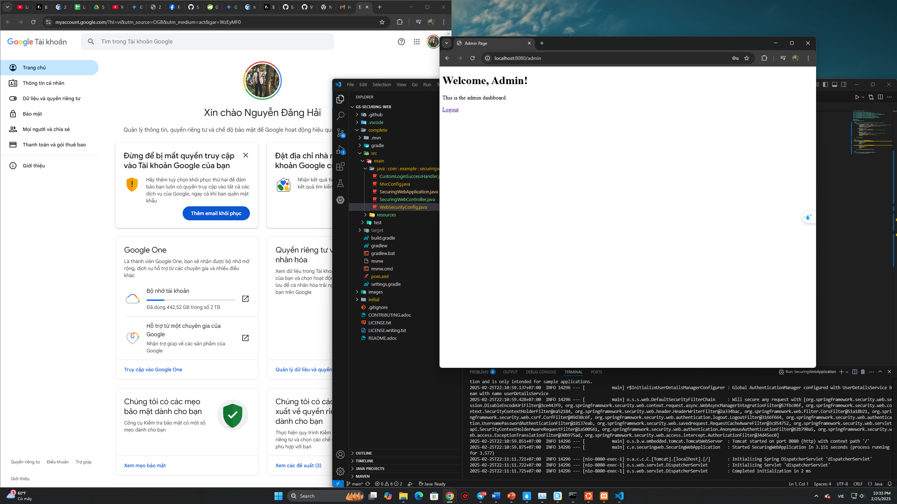
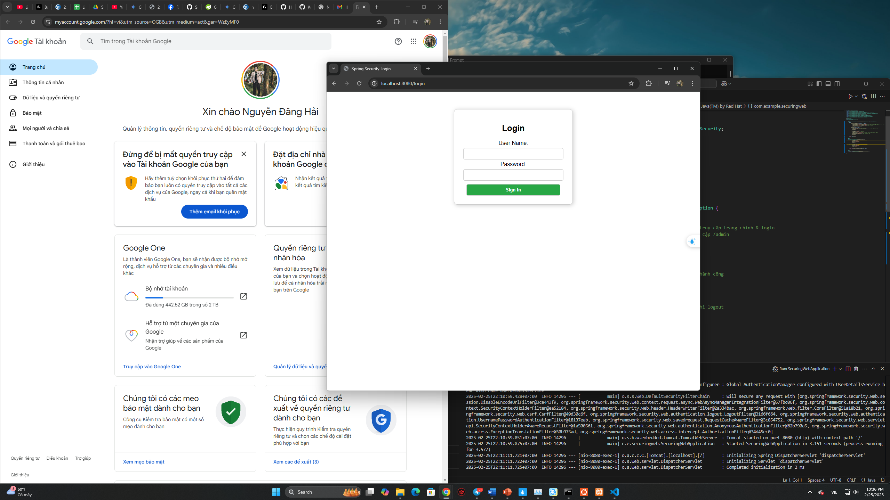
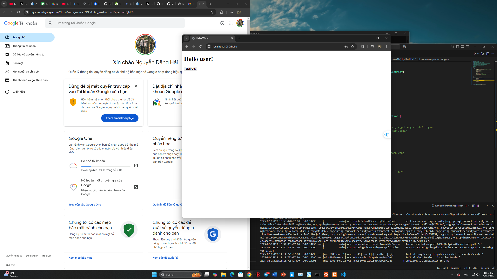

# Securing a Web Application

## Hướng dẫn chạy project

### **1. Cài đặt môi trường**
Trước khi chạy project, đảm bảo đã cài đặt các công cụ sau:
- **Java 17+** (hoặc phiên bản Java phù hợp với Spring Boot)
- **Maven** (Để kiểm tra, chạy lệnh `mvn -v` trên terminal)
- **VS Code hoặc IntelliJ IDEA** (Để chỉnh sửa code nếu cần)

### **2. Chạy project**
Mở terminal và điều hướng đến thư mục chứa project, sau đó chạy lệnh:
```sh
mvn clean spring-boot:run
```
Lệnh này sẽ:
- Xóa các file biên dịch cũ
- Biên dịch lại toàn bộ project
- Chạy ứng dụng Spring Boot trên **port 8080**

---

## **Các bước chạy thử**
Dưới đây là các bước minh chứng rằng hệ thống hoạt động đúng:

### **Bước 1: Đăng nhập dưới quyền admin**
- Nhập URL: `http://localhost:8080/`
- Sử dụng tài khoản **admin** và mật khẩu **admin123** để đăng nhập dưới quyền ADMIN.
- Truy cập thành công với đường dẫn `http://localhost:8080/admin`.


> Hình ảnh trên cho thấy giao diện sau khi đăng nhập thành công với admin.

---

### **Bước 2: Đăng xuất khỏi admin**
- Chọn phương thức `logout`
- Lập tức quay trở về giao diện login với đường dẫn `http://localhost:8080/login`.


> Hình ảnh trên cho thấy đã quay trở về màn hình login thành công.

---

### **Bước 3: Đăng nhập dưới quyền User**
- Sử dụng tài khoản **user** và mật khẩu **password** để đăng nhập dưới quyền USER.
- Truy cập thành công đường dẫn `http://localhost:8080/hello`


> Hình ảnh trên hiển thị đã đăng nhập thành công với user.

---

### **Bước 4: Đăng nhập dưới username không tồn tại**
- Nhập username và password bất kì sẽ trả về kết quả `Invalid username or password`


> Hình ảnh trên cho thấy việc Login đã thất bại.

---

Bài làm của: Nguyễn Đăng Hải - MSV 22024532
